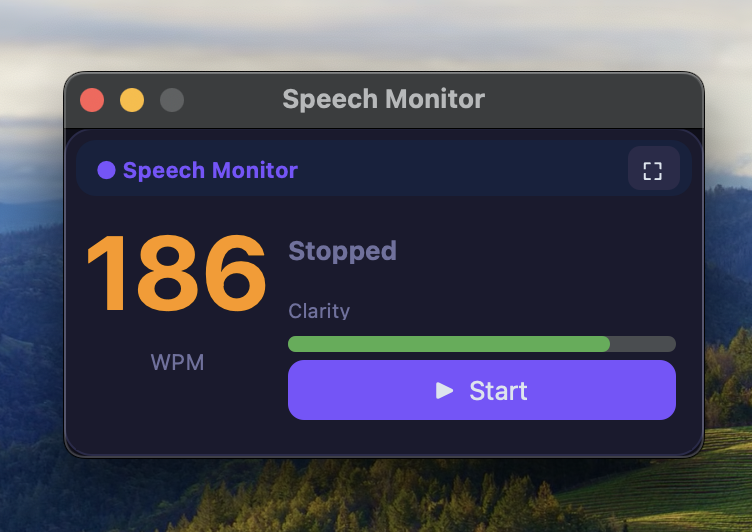
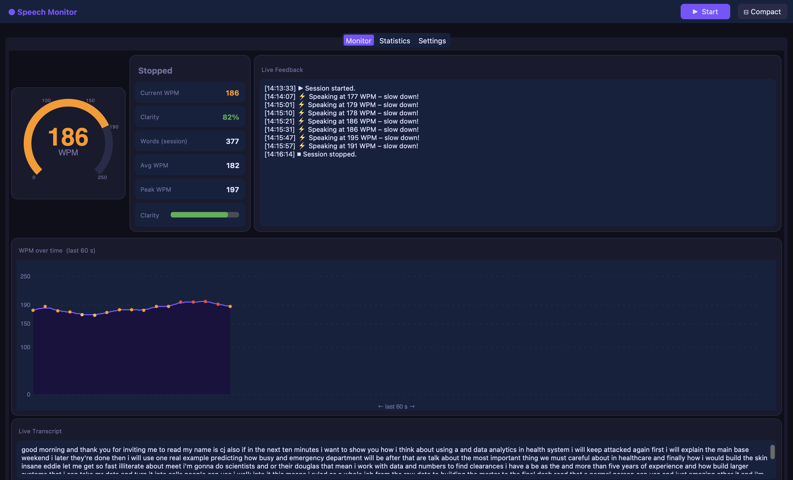
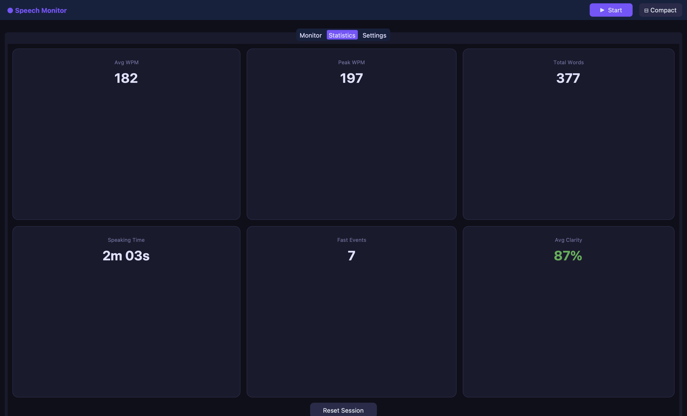
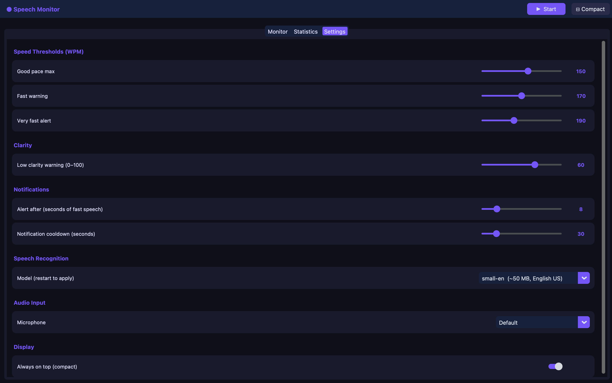

<div align="center">

# 🎙️ Speech Monitor

### **Never speak too fast in a meeting again.**

Real-time WPM tracker & clarity coach for Zoom, Teams, Skype, and Google Meet —  
running **100 % offline**, on every OS, with zero cloud dependency.

<br/>

[](https://python.org)
[](https://github.com)
[](LICENSE)
[](https://alphacephei.com/vosk/)
[](https://github.com/ouseph444/SpeechMonitor/stargazers)

<br/>



*186 WPM and climbing — the compact overlay catches it before your audience does.*

</div>

---

## 🔥 Why Speech Monitor?

You've rehearsed your presentation. You know the material.  
Then the nerves hit — and suddenly you're racing at **186 WPM**, the alerts are firing, and your audience stopped listening three slides ago.

**Speech Monitor** fixes that. A tiny floating widget watches your microphone in real time, measures your pace and clarity, and taps you on the shoulder the moment you need to slow down — **without ever sending a single byte to the cloud.**

---

## ✨ Features at a Glance

| Feature | Details |
|---|---|
| **Live WPM Gauge** | Rolling 60-second average, updates after every sentence |
| **Clarity Score** | 0–100% based on Vosk's per-word confidence — catches mumbling instantly |
| **Smart Alerts** | Desktop notification + on-screen warning when fast speech is sustained |
| **Compact Overlay** | 320 × 165 px always-on-top widget; draggable, minimal |
| **Full Dashboard** | Expand to see WPM timeline chart, live transcript, session stats |
| **100 % Offline** | Vosk AI model (~50 MB) runs entirely on your CPU — nothing leaves your device |
| **Cross-Platform** | macOS · Windows · Linux — one codebase, three installers |
| **Configurable** | Adjust every threshold, pick your mic, choose model size & language |

---

## 📸 Screenshots

<div align="center">

<table>
  <tr>
    <td align="center">
      <br/>
      <sub><b>Compact Overlay</b> — 186 WPM detected, orange alert, floats above your call</sub>
    </td>
    <td align="center">
      <br/>
      <sub><b>Live Dashboard</b> — gauge + chart + real alerts firing ("slow down!") + transcript</sub>
    </td>
  </tr>
  <tr>
    <td align="center">
      <br/>
      <sub><b>Session Statistics</b> — Avg 182 WPM · Peak 197 · 377 words · 7 fast events · 87% clarity</sub>
    </td>
    <td align="center">
      <br/>
      <sub><b>Settings</b> — every threshold, model, mic, and notification is adjustable</sub>
    </td>
  </tr>
</table>

</div>

---

## 🚀 Quick Start

### Prerequisites

- Python 3.9 or higher
- A working microphone
- **macOS only:** run `brew install python-tk@3.XX` (replace `3.XX` with your Python version) if tkinter is missing

### 1 · Clone

```bash
git clone https://github.com/ouseph444/SpeechMonitor.git
cd SpeechMonitor
```

### 2 · Install (one command)

**macOS / Linux**
```bash
chmod +x install.sh && ./install.sh
```

**Windows**
```bat
install.bat
```

> The installer creates a virtual environment and installs all dependencies.  
> The Vosk speech model (~50 MB) is downloaded automatically on first launch.

### 3 · Run

```bash
source .venv/bin/activate   # Windows: .venv\Scripts\activate
python main.py
```

---

## 🎯 How It Works

```
Microphone  ──►  sounddevice  ──►  Vosk STT (offline AI)
                                         │
                              ┌──────────▼──────────┐
                              │  Words per Minute    │
                              │  Clarity Score       │
                              │  Rolling 60-s window │
                              └──────────┬──────────┘
                                         │
                              ┌──────────▼──────────┐
                              │  CustomTkinter UI    │
                              │  Compact Overlay     │◄── always on top
                              │  Full Dashboard      │
                              └──────────┬──────────┘
                                         │
                              Desktop Notification
                              (when speaking too fast)
```

**Speech is processed locally using [Vosk](https://alphacephei.com/vosk/) — a production-grade offline speech recognition engine.** No internet connection required after the first model download.

---

## 🎨 Understanding the Colors

| Color | WPM Range | What it means |
|---|---|---|
| 🔵 Blue | < 100 WPM | Too slow — add more energy |
| 🟢 **Green** | **100 – 150 WPM** | **Perfect presentation pace** |
| 🟡 Yellow | 150 – 170 WPM | Slightly fast — breathe |
| 🟠 Orange | 170 – 190 WPM | Speaking fast — slow down |
| 🔴 Red | > 190 WPM | Way too fast — alert fires |

> All thresholds are fully adjustable in the Settings tab.

---

## ⚙️ Configuration

Open the app → Expand → **Settings** tab.

| Setting | Default | Description |
|---|---|---|
| Good pace max | 150 WPM | Upper boundary of the "green zone" |
| Fast warning | 170 WPM | Yellow threshold |
| Very fast alert | 190 WPM | Red threshold + desktop notification |
| Alert duration | 8 s | How long fast speech must persist before alerting |
| Notification cooldown | 30 s | Minimum gap between desktop notifications |
| Whisper model | `small-en` | `small-en` (50 MB), `large-en` (1.8 GB), or other languages |
| Microphone | Default | Pick any input device from the dropdown |

Settings are saved automatically to `~/.speechmonitor_config.json`.

---

## 🌍 Language Support

| Model Key | Language | Size |
|---|---|---|
| `small-en` | English (US) — default | ~50 MB |
| `large-en` | English (US) high accuracy | ~1.8 GB |
| `en-india` | English (India) | ~1 GB |
| `small-de` | German | ~50 MB |
| `small-es` | Spanish | ~50 MB |
| `small-fr` | French | ~50 MB |

Change the model in **Settings → Speech Recognition** and restart the app.

---

## 🏗️ Project Structure

```
SpeechMonitor/
├── main.py                  # Entry point
├── requirements.txt         # Dependencies
├── install.sh               # macOS / Linux installer
├── install.bat              # Windows installer
├── core/
│   ├── audio_capture.py     # Real-time mic capture via sounddevice
│   ├── speech_processor.py  # Vosk STT + WPM + clarity calculation
│   └── config.py            # Persistent JSON settings
├── ui/
│   └── app.py               # Full UI (compact overlay + dashboard)
└── utils/
    └── notifier.py          # Cross-platform desktop notifications
```

---

## 🛠️ Tech Stack

| Library | Role |
|---|---|
| [Vosk](https://alphacephei.com/vosk/) | Offline speech recognition (runs on CPU) |
| [sounddevice](https://python-sounddevice.readthedocs.io/) | Cross-platform microphone capture |
| [CustomTkinter](https://github.com/TomSchimansky/CustomTkinter) | Modern dark-theme desktop UI |
| [NumPy](https://numpy.org/) | Audio buffer math |
| [Pillow](https://pillow.readthedocs.io/) | Image handling |

---

## 🤝 Contributing

Contributions are welcome! Here are some ideas if you'd like to help:

- **More languages** — add Vosk model entries in `core/speech_processor.py`
- **Filler word detection** — flag "um", "uh", "like", "you know"
- **Export reports** — save session stats to CSV / PDF
- **Hotkey support** — start / stop without touching the mouse
- **Virtual audio capture** — monitor system audio instead of mic

```bash
# Fork → clone → branch → PR
git checkout -b feature/filler-word-detection
```

---

## 📄 License

MIT © 2025 — free to use, modify, and distribute.  
If Speech Monitor helps your presentations, a ⭐ star on GitHub means a lot!

---

<div align="center">

**Built with Python · Powered by Vosk · Runs Everywhere**

*Stop rushing. Start connecting.*

</div>
